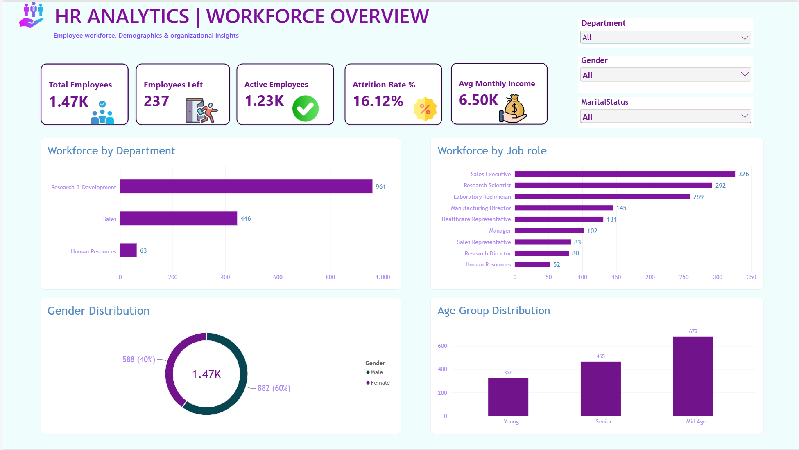
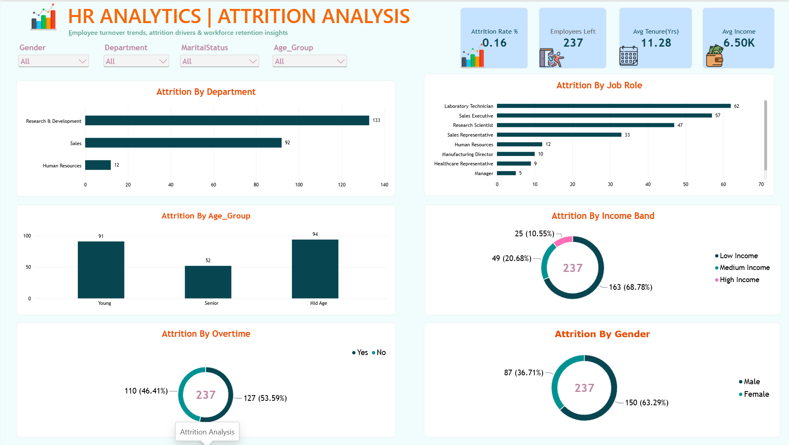
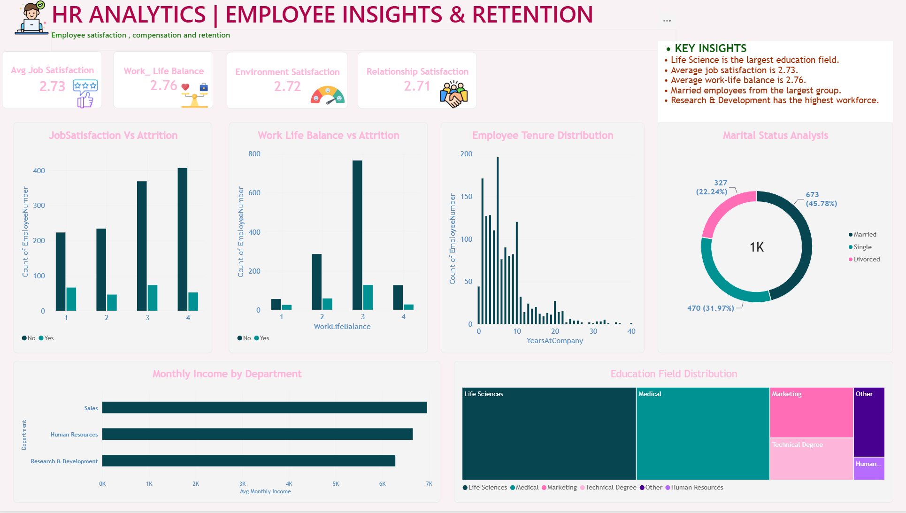

# HR Analytics: Employee Attrition Analysis

## Project Overview
This project analyzes employee attrition using **Excel, SQL and Power BI**. It identifies why employees leave and which groups are most at risk, so HR teams can make better retention decisions.

## Business Problem
Employee attrition is costly: hiring, training and lost productivity add up quickly. This analysis answers:
- How many employees have left, and what is the attrition rate?
- Which departments, job roles and age groups see the most attrition?
- How do income, overtime, tenure and satisfaction relate to attrition?

## Dataset
- **Source:** IBM HR Analytics Employee Attrition dataset
- **File:** `data/raw/IBM_HR_Attrition.csv`
- **Key columns:** Age, Department, JobRole, MonthlyIncome, OverTime, YearsAtCompany, JobSatisfaction, Attrition, and more

## Tools Used
| Tool | Purpose |
|------|---------|
| Excel | Data cleaning and preparation |
| SQL | Querying and analysis |
| Power BI | Interactive dashboard and visualization |

## KPIs
- Total Employees
- Active Employees
- Employees Left
- Attrition Rate
- Average Monthly Income

## Project Workflow
1. **Data collection:** imported the raw IBM HR dataset
2. **Data cleaning (Excel):** removed duplicates, fixed data types, handled missing values, created helper columns (e.g. age groups, income bands)
3. **Analysis (SQL):** wrote queries to calculate KPIs and attrition by department, role, age, overtime and more
4. **Visualization (Power BI):** built a three-page interactive dashboard

## Dashboard Preview

### Workforce Overview


### Attrition Analysis


### Employee Insights


## Key Insights
> Replace these with your actual findings.
- Attrition rate is **X%** overall.
- **[Department/Role]** has the highest attrition.
- Employees working **overtime** leave more often than those who don't.
- Lower **monthly income** groups show higher attrition.
- Attrition is highest among employees with **[0-2] years** at the company.

## Recommendations
- Review workload and overtime policies in high-attrition roles.
- Revisit compensation for lower income bands.
- Strengthen onboarding and engagement in the first two years.
- Run regular satisfaction surveys and act on the results.

## Repository Structure
```
HR-Analytics-Employee-Attrition-Analysis/
├── README.md
├── data/
│   ├── raw/IBM_HR_Attrition.csv
│   └── cleaned/IBM_HR_Attrition_Cleaned.xlsx
├── sql/
│   └── attrition_queries.sql
├── excel/
│   └── HR_Analysis.xlsx
├── power_bi/
│   └── HR_Analytics.pbix
└── images/
    ├── workforce_overview.png
    ├── attrition_analysis.png
    └── employee_insights.png
```

## Sample SQL Query
```sql
-- Attrition rate by department
SELECT
    Department,
    COUNT(*) AS Total_Employees,
    SUM(CASE WHEN Attrition = 'Yes' THEN 1 ELSE 0 END) AS Employees_Left,
    ROUND(100.0 * SUM(CASE WHEN Attrition = 'Yes' THEN 1 ELSE 0 END) / COUNT(*), 2) AS Attrition_Rate
FROM hr_attrition
GROUP BY Department
ORDER BY Attrition_Rate DESC;
```

## How to Use
1. Clone the repository: `git clone https://github.com/AnkitaBhali/HR-Analytics-Employee-Attrition-Analysis.git`
2. Open `data/cleaned/` to view the cleaned dataset.
3. Run the queries in `sql/attrition_queries.sql` on your SQL database.
4. Open `power_bi/HR_Analytics.pbix` in Power BI Desktop to explore the dashboard.

## Author
**Ankita Bhali**
GitHub: [AnkitaBhali](https://github.com/AnkitaBhali)
